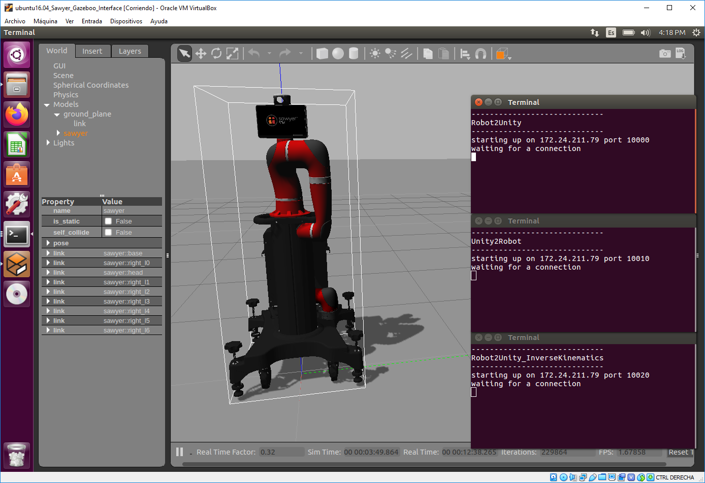

# Sawyer-Unity_Interface Virtual Machine

This VM is used as an interface between a Physical or Simulated Sawyer robot with an unity project.
The VM is available to plug and play, ask @mraau or @carlos-biru.



Installing
----------
Only if you need to install your own VM from scratch follow the "Installing" steps.

Installing intera:
https://sdk.rethinkrobotics.com/intera/Workstation_Setup

Installing simulator (if you need the simulator)
https://sdk.rethinkrobotics.com/intera/Gazebo_Tutorial

Download the git project and save it on your ./ros_ws folder.

Create the ros package for the scripts.

```sh
cd ~/ros_ws
catkin_create_pkg interface rospy
```
You might need to give execution persision to the scripts in /src/interface/src/
```sh
cd ~/ros_ws/src/interface/src/
chmod +x *.py
```


How to use it
-------------
When running the intera environment you have to run the file ./intera.sh it contains the S/N of the robot and the IP of the VM, and after you can run the scripts.

To make it easier, you can run the file "RunInterface_REAL.sh" when you are using the real robot
```sh
cd ~/ros_ws/
./RunInterface_REAL.sh
```

When using the simulator, you can run the file "RunInterface_SIMULATOR.sh"
```sh
cd ~/ros_ws/
./RunInterface_SIMULATOR.sh
```

To move the real robot you need to first enable their joints. You can do that by runing:
```sh
cd ~/ros_ws
./intera.sh
rosrun intera_interface enable_robot.py -e
```

Considerations
--------------
If using another robot you must change the S/N in the intera.sh files

If using other intera.sh files make sure tu change the IP in the file

This VM has been tested with VirtualBox 6.0.8 r130520
  - 2GB Ram, 2 CPU (more resources are desired)
  - Bridge network adapter
  - Display->Screen->3D/2D acceleration must be disabled!
